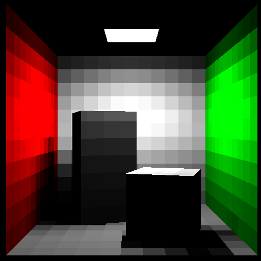
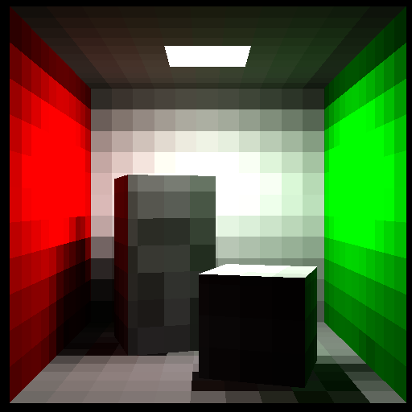
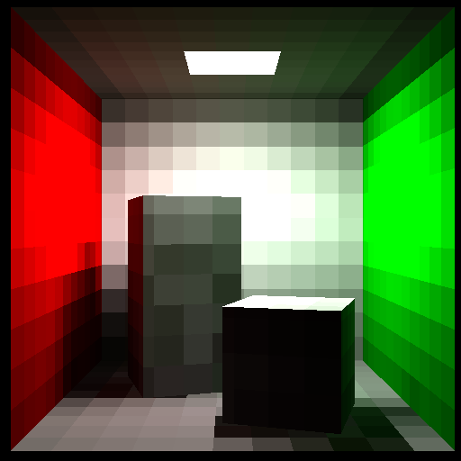

## Radiosity

A trivial implementation of radiosity method based on hemicube.

Based on [Huge Elias's method](https://www.jmeiners.com/Hugo-Elias-Radiosity/).

## Compilation
```
g++ -O2 -Wall -fopenmp -g .\radiosity.cpp -o .\radiosity.exe
```

## Results
Cornell Box with $862$ patches and $256 \times 256$ hemicube resolution.






